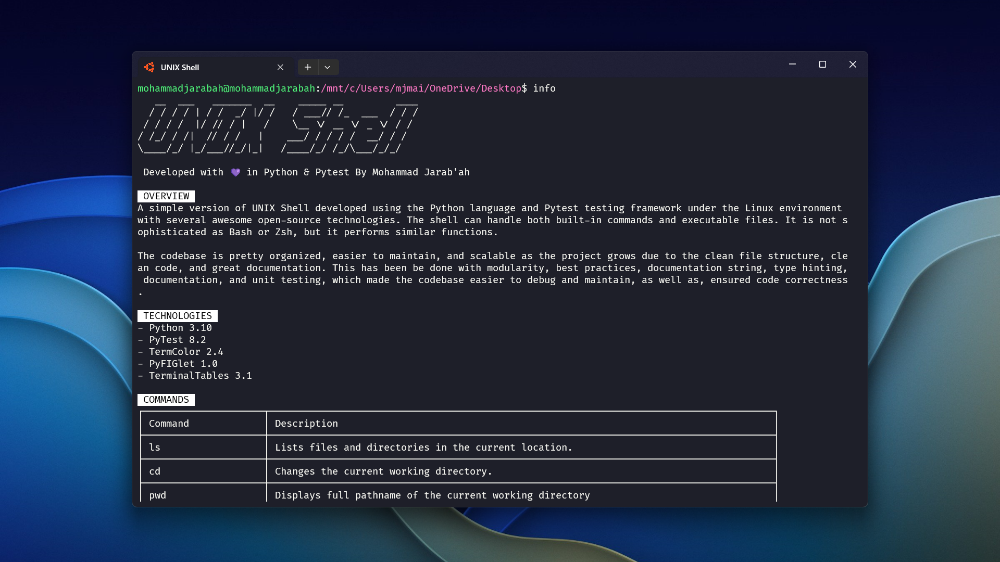
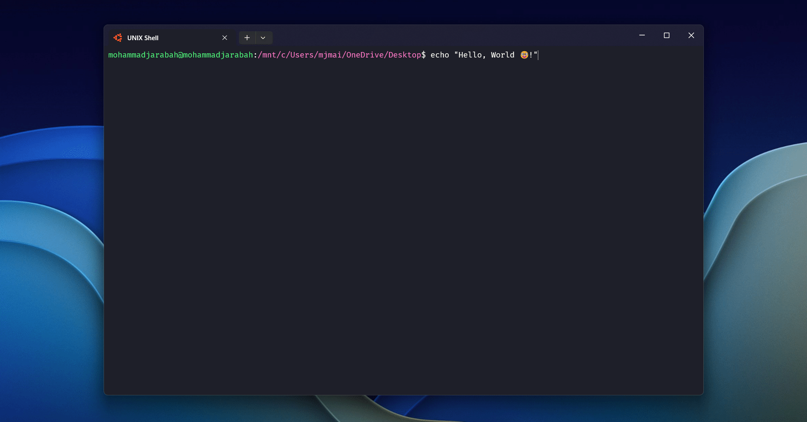

<h1 align="center">UNIX Shell</h1>

<div align="center">

*A simple version of UNIX Shell developed using Python and Pytest with awesome open-source technologies*  
[Overview](#overview) • [Preview](#preview) • [Demo](#demo) • [Shell Commands](#shell-commands) • [Technologies](#technologies) • [File Structure](#file-structure) • [Setup](#setup) • [Tests](#tests) • [License](#license)

</div>

## Overview
A simple version of UNIX Shell developed using Python programming language and Pytest framework, under a Linux environment, with several awesome [open-source technologies](#technologies). The shell can handle both [built-in commands](#shell-commands) and executable files. It is not sophisticated as *Bash* or *Zsh*, but it performs similar functions.

The codebase is pretty organized, easier to maintain, and scalable as the project grows (if that happened) due to the clean file structure, clean code, and great documentation. This has been be done with modularity, best practices, documentation, documentation strings, type hinting, and unit testing, which made the codebase easier to debug and maintain, as well as, ensured code correctness.

## Preview


## Demo


## Shell Commands
| Command | Description |
| :- | :- |
| `ls` | Lists files and directories in the current location. |
| `cd` | Changes the current working directory. |
| `pwd` | Displays full pathname of the current working directory |
| `mkdir` | Creates a new directory. |
| `touch` | Creates an empty file or updates the timestamp of an existing file. |
| `clear` | Clears the terminal screen. |
| `date` | Displays the current date. |
| `time` | Displays the current time. |
| `ps` | Displays information about currently running processes. |
| `echo` | Prints text or variables to the terminal. |
| `pid` | Displays the shell Process ID (PID). |
| `ppid` | Displays the shell Parent Process ID (PPID). |
| `info` | Provides the project documentation. |
| `help` | Provides information and help about shell commands. |
| `exit` | Terminates the current shell session. |
| Executable Files | Executes executable files located in the current directory (`./`) or the parent directory (`../`). |
<!-- information of commands and their description are sourced from `/utils/help.py` file manually -->

## Technologies
- [Python 3.10](https://github.com/python/cpython)
- [PyTest 8.2](https://github.com/pytest-dev/pytest)
- [TermColor 2.4](https://github.com/termcolor/termcolor)
- [PyFIGlet 1.0](https://github.com/pwaller/pyfiglet)
- [TerminalTables 3.1](https://github.com/matthewdeanmartin/terminaltables)

## File Structure
This project is structured to facilitate the development and testing of various utilities. The architecture is organized into several directories and files, each serving a specific purpose. Below is a detailed breakdown of the project structure.

### File Structure Contents
```tree
.
├── app.py
├── requirements.txt
├── requirements-dev.txt
├── LICENSE
├── README.md
├── .gitignore
├── utils/
├── tests/
└── .github/
```

### Files Detailed Breakdown
- `app.py` file: Contains the main function which serves as the entry point of the application
- `requirements.txt` file: Lists the dependencies needed for the application to run in production
- `requirements-dev.txt` file: Lists the dependencies needed for development, such as testing frameworks and linters
- `LICENSE` file: Specifies the terms and conditions for using and distributing the software
- `README.md` file: Provides the project documentation
- `.gitignore` file: Specifies intentionally untracked files that *Git* should ignore

### Directories Detailed Breakdown
- `utils/` directory: Contains the implementation of various utilities
- `tests/` directory: Contains unit tests for the modules in the `utils` directory
- `.github/` directory: Contains files and directories that customize and enhance the *GitHub* repository's functionality and appearance

## Setup
After cloning this repository, you should following this step-by-step instructions to setup the production environment and run the application locally on your machine.

### I. Prerequisites
1. Update and upgrade packages.
    ```sh
    sudo apt update && sudo apt upgrade -y
    ```

1. Install `Python 3.10` interpreter.
    ```sh
    sudo apt install python3.10
    ```

1. Install `python3.10-venv` package.
    ```sh
    sudo apt install python3.10-venv
    ```

### II. Creating Virtual Environment
1. Navigate to the project's root directory.

1. Create a virtual environment.
    ```sh
    python3.10 -m venv .venv
    ```

1. Activate the virtual environment.
    ```sh
    source .venv/bin/activate
    ```

1. Install production dependencies.
    ```sh
    pip install -r requirements.txt
    ```

### III. Running Shell Application
1. Make the `app.py` file executable.
    ```sh
    chmod +x app.py
    ```

1. Run the shell application.
    ```sh
    ./app.py
    ```

### IV. Exiting Shell Application
1. Simply close the terminal window or use the `exit` command to exit the terminal session.
    ```sh
    exit
    ```

1. Deactivate the virtual environment.
    ```sh
    deactivate
    ```

## Tests
This project uses [Pytest](https://github.com/pytest-dev/pytest) for unit testing. Follow the steps below to run the tests.

1. Navigate to the project's root directory, and activate the virtual environment.
    ```sh
    source .venv/bin/activate
    ```

1. Install development dependencies.
    ```sh
    pip install -r requirements-dev.txt
    ```

1. Run Pytest with basic verbosity on details.
    ```sh
    pytest -v
    ```

1. After the tests finished, deactivate the virtual environment.
    ```sh
    deactivate
    ```

## License
This project is licensed under the [MIT License](./LICENSE).